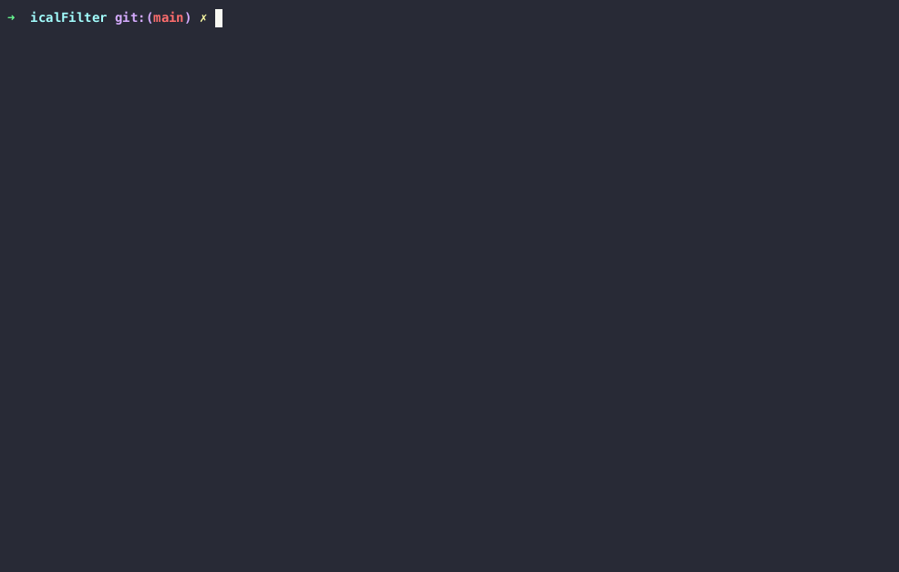

<link rel="stylesheet" href="https://cdnjs.cloudflare.com/ajax/libs/font-awesome/4.7.0/css/font-awesome.min.css">

# filterIcal <i class="fa fa-filter" style="font-size:36px"></i>

So I can quickly extract specific events from my work calendar between date ranges.

## Demo

## Usage

- `<ical-contents> | python3 filterIcal.py - -f "start-date" -t "end-date" -o "organiser-email"`
  - Assuming you've copied the ical data from your calendar source, command could look something like:
  - `pbpaste | python3 filterIcal.py - -f "17 Jun 24 7am NZST" -t "28 Jun 24 7pm NZST"`
- I pipe the output to my clipboard and paste it into my timesheet at work where I have a [userscript](https://github.com/fushSauce/VUWTimesheetTimesaver) that uses the ical data as inputs to the timesheet fields.